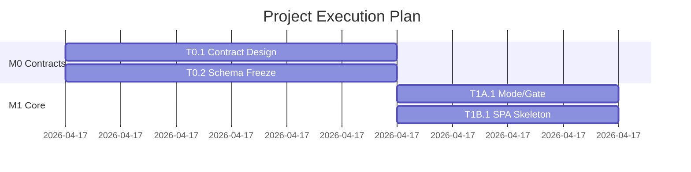
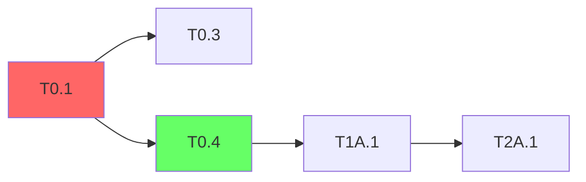

# Skill 4: Plan & Schedule

<SUBAGENT-STOP>
If you were dispatched as a subagent to execute a specific task, skip this skill.
</SUBAGENT-STOP>

Organize tasks into time-boxed batches with parallel assignment, milestone gates, and a Gantt timeline.

## Trigger

- User runs `/plan-schedule`
- User says "create execution plan", "schedule batches", "plan milestones"
- After `/task-gen` has produced `tasks.yaml`

## Input

- **Required**: `docs/plans/*-tasks.yaml` (output from skill-3)
- **Optional**: `docs/plans/project.yaml` (team config, target dates)
- **Optional**: User-specified constraints (deadline, team size, work hours)

## Execution Flow

### Step 1: Load Tasks & Project Config

1. Find the most recent `tasks.yaml`
2. Load or create `project.yaml` with defaults:
   ```yaml
   project:
     name: "Project Name"
     start_date: "2026-04-17"
     target_end: null  # Or specific deadline
     team:
       - id: DevA
         line: A
         branch: dev-a
         skills: [backend, engine]
       - id: DevB
         line: B
         branch: dev-b
         skills: [frontend, delivery]
     work_hours_per_day: 8
     parallel_capacity: 2  # How many lines work simultaneously
   ```

3. If `project.yaml` doesn't exist, ask the user for team configuration

### Step 2: Topological Sort & Critical Path

1. Build a DAG from task dependencies
2. Compute topological ordering
3. Find critical path (longest path through the DAG)
4. Compute earliest start / latest start for each task
5. Identify slack (float) for each task

### Step 3: Batch Assignment

Group tasks into batches. A batch is a set of tasks that can be worked on in parallel within a time window.

**Rules**:
- All tasks in a batch must have dependencies satisfied by earlier batches
- Each developer works on at most 1 task at a time within a batch
- Batch size ≤ team_size × 3 (to allow sequential work within a batch)
- Red tasks that block many downstream tasks should start in earlier batches (even if their phase is later)

**Algorithm**:
1. Start from topological level 0 (no dependencies)
2. Group by level, then split into batches respecting capacity
3. Apply Red-task preemption: move Red tasks earlier if they're on the critical path
4. Balance workload across lines (A/B should have roughly equal work per batch)

Output:
```yaml
batches:
  - id: batch-0
    name: "Contract Design (Pair Session)"
    milestone: M0
    schedule:
      start: "Day 1 AM"
      duration: "3 hours"
    tasks:
      - id: T0.1
        driver: DevA
        reviewer: DevB
        mode: pair  # pair | solo | parallel
      - id: T0.2
        driver: DevB
        reviewer: DevA
        mode: pair
    pre_check: "None (first batch)"
    gate: "Contract files committed and reviewed"
    
  - id: batch-1
    name: "Skeleton Build"
    milestone: M0
    schedule:
      start: "Day 1 PM"
      duration: "2 hours"
    tasks:
      - id: T0.4
        owner: DevA
        mode: solo
      - id: T0.6
        owner: DevB
        mode: parallel  # Can work simultaneously with T0.4
    pre_check: "M0 contracts committed"
    gate: "Skeleton compiles, make check passes"
```

### Step 4: Milestone Definition

For each phase boundary, define a milestone gate:

```yaml
milestones:
  - id: M0
    name: "Contracts & Skeleton"
    phase: P0
    batches: [batch-0, batch-1]
    schedule:
      target: "Day 1 EOD"
    gate_checks:
      - "All P0 tasks completed (check task-status)"
      - "Contract files frozen (no uncommitted changes)"
      - "make check passes"
      - "pytest tests/contract/ — all green"
    smoke_test:
      - scenario: "Contract test suite"
        command: "pytest tests/contract/"
        expected: "All tests pass"
```

### Step 5: Generate Collaboration Artifacts

Based on batch schedule, generate:

1. **Prompt Templates** (`docs/plans/prompt-templates.md`):
   - Task opening template (parameterized by task type)
   - Dev-loop progression template
   - Task closing template
   - Blocked/handoff templates
   
2. **Collaboration Playbook** (`docs/plans/collaboration-playbook.md`):
   - Team structure and line ownership
   - Daily workflow (Layer 1: independent, Layer 2: milestone sync, Layer 3: integration)
   - Commit message conventions
   - Contract change protocol
   - Red/Yellow task SLAs

3. **Task Status File** (`docs/plans/task-status.md`):
   - Initialize from tasks.yaml with all tasks as pending
   - Include phase tables, progress summary section
   - Define update rules

### Step 6: Generate Batch Kickoff Runbooks

For each batch (or group of related batches), generate a kickoff document:

```markdown
# Batch {N} Kickoff — {Batch Name}

## Pre-checks
- [ ] Previous milestone M{x} gate passed
- [ ] All dependency tasks completed

## Tasks
| ID | Name | Owner | Mode | Est. Duration |
|...

## Execution Order
1. Start with: {first tasks}
2. After {gate}: proceed to {next tasks}

## Decision Points
- {Red task}: {key questions to resolve}

## Smoke Test
- {E2E scenario description}
```

### Step 7: Visualization

Generate Mermaid diagrams:

**Gantt Chart**:


**Dependency Graph** (for critical path visualization):


### Step 8: Output

1. Write `docs/plans/{date}-execution-plan.yaml` (structured data)
2. Write `docs/plans/{date}-execution-plan.md` (with Mermaid diagrams)
3. Write `docs/plans/task-status.md` (initialized status table)
4. Write `docs/plans/prompt-templates.md` (CC instruction templates)
5. Write `docs/plans/collaboration-playbook.md` (team coordination)
6. Write batch kickoff files to `docs/plans/batch-{n}-kickoff.md`
7. Write `docs/plans/project.yaml` (if not existed)

### Step 9: Human Review Checkpoint

**STOP here.** Present the execution plan.

> Execution plan generated:
> - {B} batches across {M} milestones
> - Estimated duration: {D} days with {T} team members
> - Critical path: {CP} tasks ({CPD} estimated hours)
> - {R} Red tasks need early scheduling
>
> Generated files:
> - execution-plan.yaml + .md (with Gantt)
> - task-status.md (initialized)
> - prompt-templates.md
> - collaboration-playbook.md
> - {B} batch kickoff files
>
> Review and confirm. When ready, start execution with:
> - `/next-task` to pick your first task
> - `/batch-dispatch batch-0` to launch the first batch

## Scheduling Heuristics

- **Red tasks preemption**: If a Red task blocks >3 downstream tasks and is on the critical path, schedule it 1 batch earlier than its natural position
- **Buffer**: Add 20% time buffer to milestone estimates
- **Pair sessions**: First batch of each milestone should be a pair session for contract alignment
- **Integration batch**: Last batch of each milestone is reserved for smoke testing
