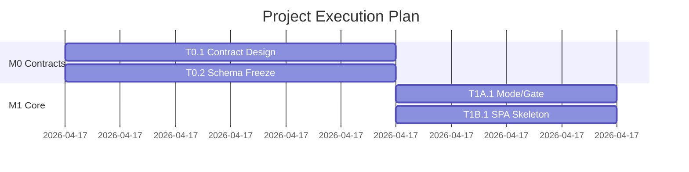
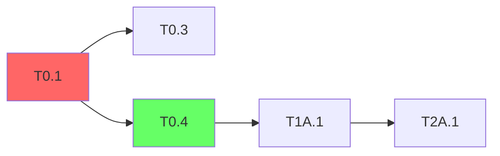

# Skill 4: Plan & Schedule

<SUBAGENT-STOP>
If you were dispatched as a subagent to execute a specific task, skip this skill.
</SUBAGENT-STOP>

Organize tasks into time-boxed batches with parallel assignment, milestone gates, and a Gantt timeline.

## Trigger

- User runs `/plan-schedule`
- User says "create execution plan", "schedule batches", "plan milestones"
- After `/task-gen` has produced `tasks.yaml`

## Input

- **Required**: `{plans_dir}/*-tasks.yaml` (output from skill-3)
- **Optional**: `docs/plans/project.yaml` (team config, target dates; always at project root)
- **Optional**: User-specified constraints (deadline, team size, work hours)

## Execution Flow

> **Path resolution**: Before constructing any output path, resolve `{plans_dir}` per `lib/plans-dir-resolver.md`. All `docs/plans/` references below (except `docs/plans/project.yaml`, which stays at repo root) are relative to that resolved directory.

### Step 1: Load Tasks & Project Config

1. Find the most recent `tasks.yaml`
2. Load or create `project.yaml`. If it doesn't exist, **ask the user**:
   - How many team lines / work streams? (1 = solo, 2 = pair, 3+ = squad)
   - For each line: id, name, skills, branch name
   - Target timeline constraints?
   
   Then generate `project.yaml` from their answers. Example for a solo developer:
   ```yaml
   project:
     team:
       - id: Dev1
         line: main
         branch: dev
         skills: [fullstack]
     parallel_capacity: 1
   ```
   
   Example for a 3-person squad:
   ```yaml
   project:
     team:
       - id: Alice
         line: backend
         branch: dev-backend
         skills: [backend, engine]
       - id: Bob
         line: frontend
         branch: dev-frontend
         skills: [frontend, delivery]
       - id: Carol
         line: infra
         branch: dev-infra
         skills: [devops, database]
     parallel_capacity: 3
   ```

### Step 2: Topological Sort & Critical Path

1. Build a DAG from task dependencies
2. Compute topological ordering
3. Find critical path (longest path through the DAG)
4. Compute earliest start / latest start for each task
5. Identify slack (float) for each task

### Step 3: Batch Assignment

Group tasks into batches. A batch is a set of tasks that can be worked on in parallel within a time window.

**Rules**:
- All tasks in a batch must have dependencies satisfied by earlier batches
- Each developer works on at most 1 task at a time within a batch
- Batch size ≤ number_of_lines × 3 (to allow sequential work within a batch)
- Red tasks that block many downstream tasks should start in earlier batches (even if their phase is later)
- If only 1 line: batches are sequential; if multiple lines: batches can have parallel tasks across lines

**Algorithm**:
1. Start from topological level 0 (no dependencies)
2. Group by level, then split into batches respecting capacity
3. Apply Red-task preemption: move Red tasks earlier if they're on the critical path
4. Balance workload across lines (each line should have roughly equal work per batch)

Output:
```yaml
batches:
  - id: batch-0
    name: "Contract Design (Pair Session)"
    milestone: M0
    schedule:
      start: "Day 1 AM"
      duration: "3 hours"
    tasks:
      - id: T0.1
        driver: Dev1
        reviewer: Dev2
        mode: pair  # pair | solo | parallel
      - id: T0.2
        driver: Dev2
        reviewer: Dev1
        mode: pair
    pre_check: "None (first batch)"
    gate: "Contract files committed and reviewed"
    
  - id: batch-1
    name: "Skeleton Build"
    milestone: M0
    schedule:
      start: "Day 1 PM"
      duration: "2 hours"
    tasks:
      - id: T0.4
        owner: Dev1
        mode: solo
      - id: T0.6
        owner: Dev2
        mode: parallel  # Can work simultaneously with T0.4
    pre_check: "M0 contracts committed"
    gate: "Skeleton compiles, make check passes"
```

### Step 4: Milestone Definition

For each phase boundary, define a milestone gate:

```yaml
milestones:
  - id: M0
    name: "Contracts & Skeleton"
    phase: P0
    batches: [batch-0, batch-1]
    schedule:
      target: "Day 1 EOD"
    gate_checks:
      - "All P0 tasks completed (check task-status)"
      - "Contract files frozen (no uncommitted changes)"
      - "make check passes"
      - "pytest tests/contract/ — all green"
    smoke_test:
      - scenario: "Contract test suite"
        command: "pytest tests/contract/"
        expected: "All tests pass"
```

### Step 4.5 — Per-Task Plan Generation (0.5.0+)

**Triggers when**: `superpowers:writing-plans` is installed AND `tasks.yaml` has at least one task.

**Read**: `lib/plans-runner.md` — follow it exactly for this step.

Steps:

#### Step 4.5a — Generate plans (self-drive pass)

```
paused_tasks = []
for task in tasks.yaml.tasks:
    spec_package = assemble_spec_package(
        task=task,
        prd_modules=prd_structure.modules filtered by task.module,
        gap_refs=gap_analysis.gaps filtered by task.story_refs,
        conventions=project.yaml + conventions.md (if exists),
        ambiguity_resolutions=prd_structure.extraction.ambiguity_resolution.resolutions
                              filtered to those affecting task.module / task.story_refs,
    )
    result = plans_runner.invoke(spec_package)
    if result.status == "ok":
        write result.plan_md_content to result.plan_md_path
        update task entry in tasks.yaml: source_plan_path = result.plan_md_path, plan_status = "ok"
    elif result.status == "paused":
        paused_tasks.append((task.id, result.pause_points))
    else:
        # error / spec too thin
        write stub plan-md per plans-runner.md § Stub fallback
        update task entry: source_plan_path = stub_path, plan_status = "stub"
```

#### Step 4.5b — Batched user interaction (only if any tasks paused)

Surface accumulated `pause_points` in batches of ≤8, prioritized by `reversibility: low` (most irreversible first).

```
all_pauses = flatten([(tid, pp) for tid, pps in paused_tasks for pp in pps])
sort by pp.reversibility (low < medium < high)
for batch in chunks(all_pauses, size=8):
    present batch to user as multi-choice questions
    collect user's choices
    apply choices to relevant task spec_packages
```

After each batch, replay `plans_runner.invoke()` for affected tasks; expect `status: ok` second time around. If a task still pauses after answer applied, surface as an error: `"task {tid} cannot be planned even after pause-point resolution; manual intervention required"`.

**When user refuses to answer a question (clicks "Skip" or equivalent)**: apply the most-reversible default option (the one with `reversibility: high`; tie-break by the `recommended` label). Replay plans-runner with that default. After replay, the generated plan_md must include a `[NEEDS_REVIEW: <decision_label>]` marker at the top of the affected plan-task body. Set the task's `plan_status: needs_review` in tasks.yaml.

#### Step 4.5c — Final state

Post-conditions of Step 4.5:
- Every task in `tasks.yaml` has `source_plan_path` set (either to a real plan_md or to a stub).
- Every plan_md is on disk at `docs/superpowers/plans/{date}-{task_id}.md`.
- `tasks.yaml` carries `plan_status: ok | stub | needs_review` per task.
- A `Step 4.5 — Plan Generation Summary` block is appended to the eventual `execution-plan.md` (Step 6):

  ```
  ## Plan Generation Summary (Step 4.5)

  - {N_ok} tasks: full plans generated
  - {N_stub} tasks: stub plans (need /generate-plan rerun): T1A.5, T2B.3
  - {N_review} tasks: full plans with [NEEDS_REVIEW] markers: T3B.1
  - Total user-interaction rounds: {R}
  - Total pause_points resolved: {P}
  ```

**Graceful degradation**: if `superpowers:writing-plans` is not installed, skip this step entirely. Log the warning prescribed in `lib/plans-runner.md §Graceful degradation`. Step 5 proceeds with `tasks.yaml` as-is — no `source_plan_path` on any task.

**Verification**: applying Step 4.5 to a tasks.yaml derived from `tests/fixtures/prd-bridge/conflict-prd.md` must:
- Produce at least one plan_md whose shape matches `tests/expected/conflict-prd.sample-plan-md.md` (H1 with "Implementation Plan", REQUIRED SUB-SKILL blockquote, ### Task N: headings, - [ ] **Step N:** bullets).
- Update tasks.yaml so every task has `source_plan_path`.
- Produce a Plan Generation Summary block in execution-plan.md.

### Step 5: Generate Collaboration Artifacts

> **Step 4.5 may have run before this** (when `superpowers:writing-plans` is installed). If so, every task in `tasks.yaml` already has `source_plan_path` set. Step 5 below produces execution-plan.yaml + execution-plan.md as usual, and the resulting tasks flow through plan-passthrough at /start-task time (skill-5 Step 5').

Based on batch schedule, generate:

1. **Prompt Templates** (`{plans_dir}/prompt-templates.md`):
   - Task opening template (parameterized by task type)
   - Dev-loop progression template
   - Task closing template
   - Blocked/handoff templates
   
2. **Collaboration Playbook** (`{plans_dir}/collaboration-playbook.md`):
   - Team structure and line ownership
   - Daily workflow (Layer 1: independent, Layer 2: milestone sync, Layer 3: integration)
   - Commit message conventions
   - Contract change protocol
   - Red/Yellow task SLAs

3. **Task Status File** (`{plans_dir}/task-status.md`):
   - Initialize from tasks.yaml with all tasks as pending
   - Include phase tables, progress summary section
   - Define update rules

### Step 6: Generate Batch Kickoff Runbooks

For each batch (or group of related batches), generate a kickoff document:

```markdown
# Batch {N} Kickoff — {Batch Name}

## Pre-checks
- [ ] Previous milestone M{x} gate passed
- [ ] All dependency tasks completed

## Tasks
| ID | Name | Owner | Mode | Est. Duration |
|...

## Execution Order
1. Start with: {first tasks}
2. After {gate}: proceed to {next tasks}

## Decision Points
- {Red task}: {key questions to resolve}

## Smoke Test
- {E2E scenario description}
```

### Step 7: Visualization

Generate Mermaid diagrams:

**Gantt Chart**:


**Dependency Graph** (for critical path visualization):


### Step 8: Output

1. Write `{plans_dir}/{date}-execution-plan.yaml` (structured data)
2. Write `{plans_dir}/{date}-execution-plan.md` (with Mermaid diagrams)
3. Write `{plans_dir}/task-status.md` (initialized status table)
4. Write `{plans_dir}/prompt-templates.md` (CC instruction templates)
5. Write `{plans_dir}/collaboration-playbook.md` (team coordination)
6. Write batch kickoff files to `{plans_dir}/batch-{n}-kickoff.md`
7. Write `docs/plans/project.yaml` (if not existed)

### Step 9: Human Review Checkpoint

**STOP here.** Present the execution plan.

> Execution plan generated:
> - {B} batches across {M} milestones
> - Estimated duration: {D} days with {T} team members
> - Critical path: {CP} tasks ({CPD} estimated hours)
> - {R} Red tasks need early scheduling
>
> Generated files:
> - execution-plan.yaml + .md (with Gantt)
> - task-status.md (initialized)
> - prompt-templates.md
> - collaboration-playbook.md
> - {B} batch kickoff files
>
> Review and confirm. When ready, start execution with:
> - `/next-task` to pick your first task
> - `/batch-dispatch batch-0` to launch the first batch

## Scheduling Heuristics

- **Red tasks preemption**: If a Red task blocks >3 downstream tasks and is on the critical path, schedule it 1 batch earlier than its natural position
- **Buffer**: Add 20% time buffer to milestone estimates
- **Pair sessions**: First batch of each milestone should be a pair session for contract alignment
- **Integration batch**: Last batch of each milestone is reserved for smoke testing
