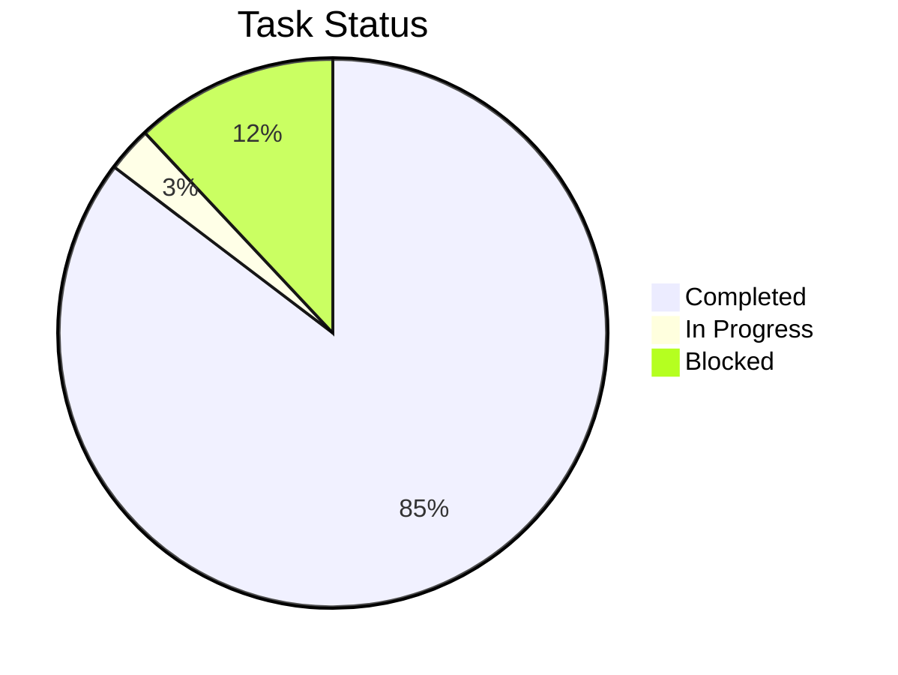
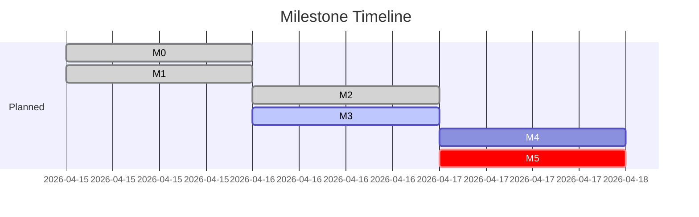

# Skill 9: Task Status

<SUBAGENT-STOP>
If you were dispatched as a subagent to execute a specific task, skip this skill.
</SUBAGENT-STOP>

Display a comprehensive progress dashboard with statistics, visualizations, and actionable insights.

## Trigger

- User runs `/task-status`
- User says "show progress", "task status", "how are we doing", "project status"

## Input

- **Data sources** (checked in order):
  1. `{plans_dir}/tasks.yaml` (structured, preferred)
  2. `{plans_dir}/task-status.md` (fallback)
  3. `{plans_dir}/*-execution-plan.yaml` (for timeline comparison)

## Execution Flow

> **Path resolution**: Before constructing any read/output path, resolve `{plans_dir}` per `lib/plans-dir-resolver.md`. All `docs/plans/` references above/below (except `docs/plans/project.yaml`, which stays at repo root) are relative to that resolved directory. `.artifacts/` paths are NOT scoped — they remain shared across plans_dir (see design spec §8 Limitation 1).

### Step 1: Load Data

1. Read tasks from `tasks.yaml` or parse `task-status.md`
2. Read execution plan for timeline targets
3. Read artifact data via `dev-loop-skills:skill-6-artifact-registry` when available:

   **Primary path** (dev-loop installed):
   ```
   /artifact-registry query --task-id {task_id} --status executed
   ```
   Consume the returned list as the task's artifact set. The registry
   skill validates state transitions and link integrity; direct file
   reads do not.

   **Fallback** (dev-loop missing):
   Fall back to direct read of `.artifacts/registry.json`. Note that
   without the registry skill, the dashboard cannot detect coverage
   gaps (see Step 2.x below).

4. **Coverage-gap surfacing** (0.4.0+, when dev-loop installed):
   For each task marked `completed` in tasks.yaml, query the registry
   for any artifact with `status: executed` linked to that task. Tasks
   marked done but with NO executed artifact are flagged in the
   dashboard as `🔵 done — no executed test-plan` (a coverage gap, not
   a failure). This is the metric the AutoService team has been
   re-discovering manually after every milestone.

### Step 2: Compute Statistics

```yaml
overall:
  total: 75
  pending: 0
  in_progress: 2
  completed: 64
  blocked: 9
  failed: 0
  progress_pct: 85

by_phase:
  - phase: P0
    total: 6
    completed: 6
    pct: 100
  - phase: P1
    total: 17
    completed: 17
    pct: 100
  # ...

by_type:
  green: { total: 48, completed: 45, pct: 94 }
  yellow: { total: 18, completed: 15, pct: 83 }
  red: { total: 9, completed: 4, pct: 44 }

by_line:
  # Dynamic — one entry per line from project.yaml
  # Example for 2-line team:
  backend: { total: 43, completed: 38, pct: 88 }
  frontend: { total: 29, completed: 24, pct: 83 }
  shared: { total: 3, completed: 2, pct: 67 }
```

### Step 3: Identify Issues

**In-progress tasks**:
- List each 🟦 task with owner and how long it's been in progress
- Flag tasks in_progress for >1 day as potentially stuck

**Blocked tasks**:
- List each ⚠️ task with blocker reason
- Identify if any blockers have been resolved (check dependencies)

**Risk alerts**:
- Tasks behind schedule (compare with execution-plan timeline)
- Red tasks not yet started that block upcoming milestones
- Imbalanced workload between lines (only when multiple lines exist)

### Step 4: Generate Dashboard

Output formatted dashboard:

```
# Project Status — {date}

## Overall Progress
██████████████████░░ 85% (64/75)

## By Phase
P0 Contracts    ██████████ 100% (6/6)  ✅
P1 Core         ██████████ 100% (17/17) ✅
P2 Workbench    ██████████ 100% (12/12) ✅
P3 Admin        █████████░  93% (13/14) 🟦 1 in progress
P4 Dream+Bill   ██████████ 100% (13/13) ✅
P5 zchat        ████░░░░░░  31% (4/13)  ⚠️ 9 blocked

## Active Tasks
| Task | Name | Owner | Duration | Status |
|------|------|-------|----------|--------|
| T3B.7 | Management chat | Dev1 | 2h | 🟦 in progress |

## Blocked Tasks
| Task | Blocker | Impact |
|------|---------|--------|
| T5A.1-8 | zchat API not ready | Blocks entire P5 |
| T5B.4 | Depends on T5A.8 | Blocks E2E |

## Risk Alerts
⚠️ P5 has 9 blocked tasks — zchat dependency unresolved
⚠️ M5 target (Fri PM) at risk if zchat not available by Thu

## Next Actions
1. Resolve zchat blocker or switch to Plan B (LocalEngine)
2. Complete T3B.7 (last in-progress task)
3. Run /smoke-test M4 when T3B.7 completes
```

### Step 5: Mermaid Visualization (Optional)

If the user asks for a visual or the terminal supports it:

**Progress by Phase (Pie)**:


**Timeline vs Actual (Gantt)**:


## Compact Mode

If the user just wants a quick status (e.g., in a script or hook):
```
prd2impl: 85% (64/75) | 🟦 2 active | ⚠️ 9 blocked | next: T3B.7
```
